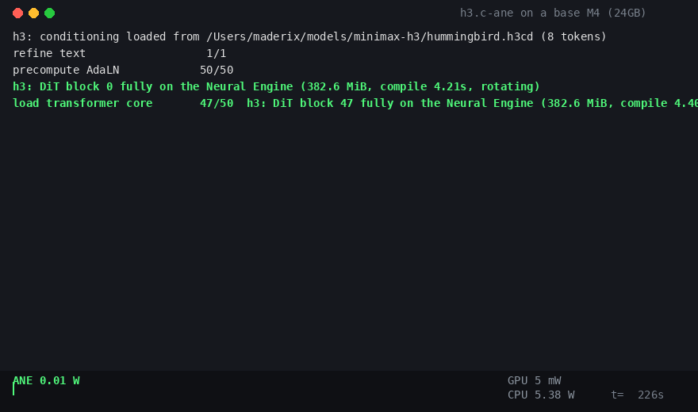

# h3.c-ane

MiniMax-H3 video generation on the Apple Neural Engine. This is a fork of
[antirez's h3.c](https://github.com/antirez/h3.c) that runs every transformer
block of the H3 DiT on the ANE of a base 24GB M4 Mac mini. The 50 blocks hold
about 19 billion parameters (a 21GB int8 checkpoint). The machine cannot hold
the model in memory and the ANE was never meant to run something this large.
It runs anyway: weights stream from SSD, compiled ANE models rotate through a
small residency window, and the Metal GPU only packs tensors in and out and
decodes the final video.



The capture above is the M4 mid-generation. The Neural Engine pulls about
3.6W while the GPU sits at 16mW. Each block loads, evaluates, and rotates
out, live.


The result: 4 seconds of video with audio, 6 denoise steps, prompt "a
hummingbird hovering over a flower". End to end this takes about 8.5 minutes
(DiT 370s, VAE 88s) and the process peaks at 2.1GB of RAM.

## Why

h3.c already runs H3 well on the GPU with Metal. This fork answers a
different question: can the Neural Engine, a fixed-function accelerator with
no public low-level API, a 16KB alignment rulebook, and an fp16-only
datapath, run a large modern diffusion transformer end to end. It can. Treat
this as a proof of concept, not as the fast path.

## Tutorial

### 1. Build

```sh
make h3
```

Build on Apple Silicon with the Xcode command line tools. Install ffmpeg
(`brew install ffmpeg`) for the final mp4 mux.

### 2. Get the model

Download the ComfyUI int8 release of MiniMax H3:

- `minimax_h3_fl2va_pruned_int8_convrot.safetensors` (21GB DiT, int8)
- `minimax_h3_video_vae_fp16.safetensors`
- `minimax_h3_audio_vae_fp32.safetensors`
- the MiniMax-H3 tokenizer and config folder (FL2VA)

Arrange them as h3.c expects. See `README.upstream.md` for the layout.

### 3. Mint the text conditioning

The text encoder is 50 layers of Qwen3-VL-32B, 51GB in BF16, too big for a
24GB Mac. Run the encoder once on any machine with a GPU and enough disk,
then copy the small `.h3cd` file to the Mac:

```sh
python3 scripts/mint_h3_conditioning.py \
    --prompt "a hummingbird hovering over a flower" \
    --te qwen3vl_32b_minimax_h3_bf16.safetensors \
    --tokenizer tokenizer.json --out hummingbird.h3cd
```

### 4. Generate on the Neural Engine

```sh
H3_CONDITIONING_FILE=hummingbird.h3cd \
H3_ANE_FULL_BLOCKS=50 H3_ANE_ROTATE=1 \
./h3 -d MiniMax-H3 -p "a hummingbird hovering over a flower" \
    --width 512 --height 512 --render-width 384 --render-height 384 \
    --seconds 4 --steps 6 --ssd-streaming -o out.mp4
```

The first run compiles all 50 ANE block models, about 2 seconds each. They
are cached in `$TMPDIR/h3-ane-cache` (about 19GB), so every later run loads
them in milliseconds.

The cache grows. Every distinct resolution and length compiles its own set
of blocks, about 19GB per shape, because an ANE MIL graph is compiled for
fixed shapes. That is how the Neural Engine works today. On top of that,
Apple's ANE daemon keeps its own copy of every compiled model in
`/Library/Caches/com.apple.aned`, so the real disk cost of a compile is
roughly double. macOS purges `$TMPDIR` eventually, but not aned's cache.
If disk gets tight, delete both:

```sh
rm -rf "$TMPDIR/h3-ane-cache"
sudo rm -rf /Library/Caches/com.apple.aned/*
```

This is always safe. Everything regenerates from the checkpoint on the next
run. If generation dies with the machine out of disk, check aned's cache
first; it grew to 58GB in one day of development on this port.

## Environment switches

| Variable | Meaning |
|---|---|
| `H3_ANE_FULL_BLOCKS=N` | Run the first N DiT blocks as whole ANE graphs (50 = all) |
| `H3_ANE_ROTATE=1` | Rotate ANE models through memory (required for large N on 24GB) |
| `H3_ANE_CACHE=0` | Disable the compiled-model cache |
| `H3_CONDITIONING_FILE=x.h3cd` | Use precomputed text conditioning (skips the 51GB text encoder) |
| `H3_PROFILE=1` | Print per-stage timing and memory |
| `H3_ANE_DEBUG_RANGE=1` | Print per-block activation peaks and non-finite counts |

## What runs on the Neural Engine

Each of the 50 DiT blocks is one hand-written MIL graph, compiled straight
through the private `AppleNeuralEngine.framework`. There is no CoreML in the
path. One block is one ANE program containing:

- Int8 weights, dequantized on the fly. The weights are `constexpr` int8
  tensors with fp16 per-row scales. The ConvRot Hadamard rotation the
  checkpoint was quantized with is applied to activations in-graph. Int8
  stays int8 in memory; nothing is materialized as BF16 for the ANE.
- AdaLN modulation: shift, scale, and gate for three modality segments
  (text, audio, video), sliced from one packed input plane.
- RMSNorm on a 1/256 pre-scale. The ANE has no `reduce_mean` or `rsqrt`, so
  the norm is `reduce_sum` plus `pow(x, -0.5)` with the epsilon folded
  through.
- QKV projection, per-head norm, and 3-axis RoPE. The 48 rotated frequency
  pairs are built from slice and concat, since the ANE has no rotate-half
  primitive.
- Full softmax attention, tiled over query rows. 512-row tiles keep the
  score tensor at `[1,56,512,S]` instead of `[1,56,S,S]`. That is the
  difference between 200MB and 1.3GB of wired memory per block.
- A SwiGLU MLP with a 1/16 pre/post scale bracket around fc2. The trained
  model's fc2 output peaks at 4.3e4, right at the edge of fp16.
- Gated residual adds carrying an adaptive power-of-two range guard. The
  residual stream saturates fp16 from block 0, so the host scales each
  block's input by a power of two, folds 1/s into the gate slots (the
  algebra is exact), and scales the output back. Power-of-two scaling only
  moves the fp16 exponent, so the guard is lossless.

Around the graphs:

- Model rotation. A compiled 385M-parameter block wires about 800MB, so 50
  resident blocks can never fit. Models unload and reload through a
  content-addressed compile cache. A prefetch thread hides the next block's
  250ms disk read behind the current block's 280ms ANE evaluation.
- Metal does the rest: tensor pack and unpack into IOSurfaces, the
  embedders, the final head, and both VAEs. The GPU profile during denoise
  shows `linear=0 conv=0 attention=0`. All transformer math is on the ANE.
- The raw private-framework plumbing lives behind one small interface,
  `h3_ane_bridge.{h,m}`. Everything else speaks MIL text and IOSurfaces.

Numerics: a seeded all-ANE render is frame-cosine 0.99 against the
pure-Metal render at 2 steps, and visually identical at 6 steps. The
int8/fp16 ANE path drifts from the BF16 Metal path exactly as much as
expected, and no more.

## The Neural Engine is really doing the work

`powermetrics` during denoise:


## Disclaimer

This is a proof of concept, not production software.

- It drives a private Apple framework (`AppleNeuralEngine.framework`)
  through `objc_msgSend`. Any macOS update can break it. Nothing here is
  App Store safe.
- Timing: on a base M4 at these settings the all-ANE path runs a denoise
  step in 26.3s against 31.9s for the Metal path, about 17% faster. That is
  not the point, and bigger GPUs win easily. The point is that it runs at
  all, correctly, on the smallest Apple Silicon machine, while the GPU sits
  at 16 milliwatts.
- Resources: expect about 19GB of compiled-model cache on disk per shape,
  sustained SSD reads during generation, and a genuinely busy machine. The
  Q-tiled attention and the rotation exist because earlier versions wired
  12GB+ of kernel memory and rebooted the machine. A memory watchdog is
  prudent.
- fp16 is right at the edge for this model. The range guards are measured
  and gated, but other checkpoints may find new cliffs.

## Next steps

- Overlap the Metal pack and unpack with ANE evaluation. They serialize
  today.
- Native 512x512 renders. The ANE per-block advantage grows with sequence
  length.
- A second model family through the same bridge, to see which parts
  generalize.

## Thanks

- [antirez](https://github.com/antirez) for h3.c: the cleanest possible
  base to build on, and the reason this fork could focus on the ANE alone.
- MiniMax for the H3 model, and Comfy-Org for the int8 ConvRot quantization
  this port consumes.

## License

MIT, same as upstream h3.c. See `LICENSE`.
