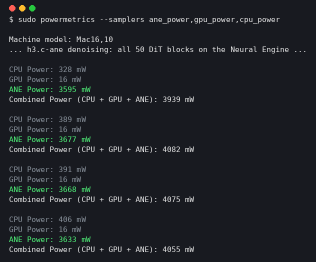

# h3.c-ane

Making a tiny base-model Mac mini run a 19-billion-parameter video model has distinct David and Goliath energy, except David is a small aluminum box and nobody asked for its consent. The Neural Engine was handed 21GB of weights and a problem several sizes above its pay grade. It ran them anyway, presumably because Apple did not include a union.

MiniMax-H3 video generation on the Apple Neural Engine. This fork of
[antirez's h3.c](https://github.com/antirez/h3.c) runs every transformer block
of the H3 DiT on the ANE in a base 24GB M4 Mac mini. The 50 blocks contain
about 19 billion parameters (a 21GB int8 checkpoint). The machine cannot hold
the entire model in memory, and the ANE was not designed to run a model this
large. The implementation streams weights from SSD, rotates compiled ANE
models through a small residency window, and uses the Metal GPU only to pack
tensors in and out and decode the final video.


4 seconds of video with audio, generated with 6 denoise steps and the prompt
"a hummingbird hovering over a flower". End-to-end generation takes about
8.5 minutes (DiT 370s, VAE 88s), and the process peaks at 2.1GB of RAM.


The obligatory self portrait, also generated on the Neural Engine (20
denoise steps): the model depicting its own working conditions.

## Why

h3.c already runs H3 well on the GPU with Metal. This fork explores a
different question: can the Neural Engine, a fixed-function accelerator with
no public low-level API, a 16KB alignment rulebook, and an fp16-only datapath,
run a large modern diffusion transformer end to end? It can. Treat this as a
proof of concept, not as the fast path.

This project builds on [maderix/ANE](https://github.com/maderix/ANE), which
reverse-engineers the private ANE APIs sufficiently to train networks on the
Neural Engine. That work established the MIL behavior, alignment rules, and
bridge techniques used here.

## What is different from h3.c

Everything upstream still works. The ANE path is opt-in through environment
variables, and with them unset this fork behaves like h3.c. The differences:

- The transformer runs on the Neural Engine. Set `H3_ANE_FULL_BLOCKS=50` and
  `H3_ANE_ROTATE=1` and all 50 DiT blocks execute as ANE programs
  (`h3_ane_block.m`, `h3_ane_linear.m`, `h3_ane_bridge.m`). Upstream runs
  them on the GPU with Metal.
- It targets a small machine. Upstream keeps the BF16 model resident, which
  wants a 64GB or larger Mac. This fork streams the 21GB int8 checkpoint
  from SSD and peaks at about 2GB of RAM, so a base 24GB M4 works.
- It consumes the ComfyUI int8 ConvRot checkpoint instead of the official
  BF16 release: int8 weights with Hadamard-rotated rows, adaLN lookup
  tables instead of the time-embedding MLP, a conventional-order QKV that
  gets regrouped at load, and an fp16 video VAE (`h3_convrot.c` and the
  loader changes in `h3_weights.c`).
- Text conditioning is precomputed. The 51GB text encoder never runs on the
  Mac; `scripts/mint_h3_conditioning.py` produces a small `.h3cd` file on
  any GPU box and `H3_CONDITIONING_FILE` consumes it.
- New tests cover the ANE pieces: the int8 projection contract, the full
  block graph against a float64 reference, model rotation, and the compile
  cache (`tests/test_ane_*.c`, `tests/test_convrot_weights.c`).

## Tutorial

### 1. Build

```sh
make h3
```

Build on Apple Silicon with the Xcode command line tools. Install ffmpeg
(`brew install ffmpeg`) to create the final mp4.

### 2. Get the model

Download the ComfyUI int8 release of MiniMax H3:

- `minimax_h3_fl2va_pruned_int8_convrot.safetensors` (21GB DiT, int8)
- `minimax_h3_video_vae_fp16.safetensors`
- `minimax_h3_audio_vae_fp32.safetensors`
- the MiniMax-H3 tokenizer and config folder (FL2VA)

Arrange them as h3.c expects. See `README.upstream.md` for the layout.

### 3. Mint the text conditioning

The text encoder consists of 50 layers of Qwen3-VL-32B and occupies 51GB in
BF16, which is too large for a 24GB Mac. Run the encoder once on any machine
with a GPU and enough disk space, then copy the small `.h3cd` file to the Mac:

```sh
python3 scripts/mint_h3_conditioning.py \
    --prompt "a hummingbird hovering over a flower" \
    --te qwen3vl_32b_minimax_h3_bf16.safetensors \
    --tokenizer tokenizer.json --out hummingbird.h3cd
```

### 4. Generate on the Neural Engine

```sh
H3_CONDITIONING_FILE=hummingbird.h3cd \
H3_ANE_FULL_BLOCKS=50 H3_ANE_ROTATE=1 \
./h3 -d MiniMax-H3 -p "a hummingbird hovering over a flower" \
    --width 512 --height 512 --render-width 384 --render-height 384 \
    --seconds 4 --steps 6 --ssd-streaming -o out.mp4
```

The first run compiles all 50 ANE block models, taking about 2 seconds per
model. The models are cached in `$TMPDIR/h3-ane-cache` (about 19GB), so
subsequent runs load them in milliseconds.

The cache grows over time. Every distinct resolution and length requires its
own compiled set of blocks, about 19GB per shape, because an ANE MIL graph is
compiled for fixed shapes. That is how the Neural Engine works today. Apple's
ANE daemon also keeps its own copy of every compiled model in
`/Library/Caches/com.apple.aned`, so the actual disk cost of a compile is
roughly double. macOS eventually purges `$TMPDIR`, but not aned's cache. If
disk space runs low, delete both:

```sh
rm -rf "$TMPDIR/h3-ane-cache"
sudo rm -rf /Library/Caches/com.apple.aned/*
```

This is always safe. Everything regenerates from the checkpoint on the next
run. If generation stops because the machine runs out of disk space, check
aned's cache first; it grew to 58GB in one day of development on this port.

## Environment switches

| Variable | Meaning |
|---|---|
| `H3_ANE_FULL_BLOCKS=N` | Run the first N DiT blocks as whole ANE graphs (50 = all) |
| `H3_ANE_ROTATE=1` | Rotate ANE models through memory (required for large N on 24GB) |
| `H3_ANE_CACHE=0` | Disable the compiled-model cache |
| `H3_CONDITIONING_FILE=x.h3cd` | Use precomputed text conditioning (skips the 51GB text encoder) |
| `H3_PROFILE=1` | Print per-stage timing and memory |
| `H3_ANE_DEBUG_RANGE=1` | Print per-block activation peaks and non-finite counts |

## What runs on the Neural Engine

Each of the 50 DiT blocks is a hand-written MIL graph compiled directly
through the private `AppleNeuralEngine.framework`. CoreML is not in the
execution path. Each block is an ANE program containing:

- Int8 weights, dequantized on the fly. The weights are `constexpr` int8
  tensors with fp16 per-row scales. The ConvRot Hadamard rotation used to
  quantize the checkpoint is applied to activations in-graph. Int8 remains
  int8 in memory; nothing is materialized as BF16 for the ANE.
- AdaLN modulation: shift, scale, and gate for three modality segments
  (text, audio, video), sliced from one packed input plane.
- RMSNorm on a 1/256 pre-scale. The ANE has no `reduce_mean` or `rsqrt`, so
  the norm is `reduce_sum` plus `pow(x, -0.5)` with the epsilon folded
  through.
- QKV projection, per-head norm, and 3-axis RoPE. The 48 rotated frequency
  pairs are constructed with slice and concat because the ANE has no
  rotate-half primitive.
- Full softmax attention, tiled over query rows. 512-row tiles keep the
  score tensor at `[1,56,512,S]` instead of `[1,56,S,S]`. That is the
  difference between 200MB and 1.3GB of wired memory per block.
- A SwiGLU MLP with a 1/16 pre/post scale bracket around fc2. The trained
  model's fc2 output peaks at 4.3e4, right at the edge of fp16.
- Gated residual adds with an adaptive power-of-two range guard. The residual
  stream saturates fp16 from block 0, so the host scales each block's input by
  a power of two, folds 1/s into the gate slots (the algebra is exact), and
  scales the output back. Power-of-two scaling changes only the fp16 exponent,
  so the guard is lossless.

Around the graphs:

- Model rotation. A compiled 385M-parameter block wires about 800MB, so 50
  resident blocks cannot fit. Models unload and reload through a
  content-addressed compile cache. A prefetch thread hides the next block's
  250ms disk read behind the current block's 280ms ANE evaluation.
- Metal handles the remaining work: tensor packing and unpacking into
  IOSurfaces, the embedders, the final head, and both VAEs. The GPU profile
  during denoise shows `linear=0 conv=0 attention=0`. All transformer math
  runs on the ANE.
- The raw private-framework plumbing sits behind one small interface,
  `h3_ane_bridge.{h,m}`. Everything else uses MIL text and IOSurfaces.

Numerics: a seeded all-ANE render has frame-cosine 0.99 against the pure-Metal
render at 2 steps and is visually identical at 6 steps. The int8/fp16 ANE
path drifts from the BF16 Metal path by the expected amount and no more.

## The Neural Engine is really doing the work

`powermetrics` during denoise:



## Disclaimer

This is a proof of concept, not production software.

- It drives a private Apple framework (`AppleNeuralEngine.framework`) through
  `objc_msgSend`. Any macOS update can break it. Nothing here is App Store
  safe.
- Timing: on a base M4 at these settings the all-ANE path runs a denoise
  step in 26.3s against 31.9s for the Metal path, about 17% faster. That is
  not the point, and bigger GPUs win easily. The point is that it runs at
  all, correctly, on the smallest Apple Silicon machine, while the GPU sits
  at 16 milliwatts.
- Resources: expect about 19GB of compiled-model cache on disk per shape,
  sustained SSD reads during generation, and a genuinely busy machine. The
  Q-tiled attention and rotation are necessary because earlier versions wired
  12GB+ of kernel memory and rebooted the machine. A memory watchdog is
  prudent.
- fp16 is right at the edge for this model. The range guards are measured
  and gated, but other checkpoints may find new cliffs.

## Next steps

- Overlap the Metal pack and unpack with ANE evaluation. They serialize
  today.
- Native 512x512 renders. The ANE per-block advantage grows with sequence
  length.
- Run a second model family through the same bridge to determine which parts
  generalize.

## Thanks

- [antirez](https://github.com/antirez) for h3.c, which provided the base that
  allowed this fork to focus on the ANE.
- MiniMax for the H3 model and Comfy-Org for the int8 ConvRot quantization
  used by this port.
- [maderix/ANE](https://github.com/maderix/ANE) for the private-API groundwork
  supporting this port.

## License

MIT, same as upstream h3.c. See `LICENSE`.
